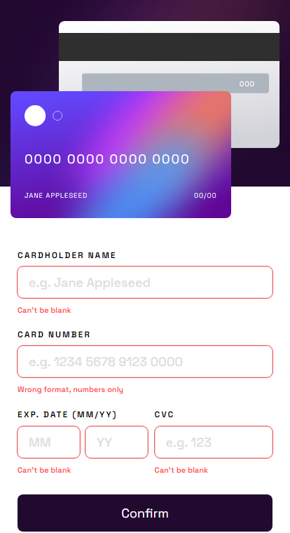
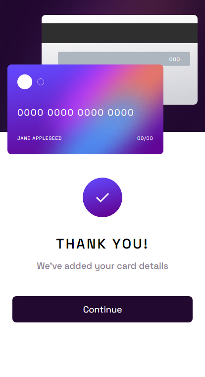

# Frontend Mentor - Interactive card details form
This is a solution to the "Interactive card details form" challenge on [Frontend Mentor](https://www.frontendmentor.io/challenges/interactive-card-details-form-XpS8cKZDWw).

## The challenge
Your challenge is to build out this interactive card details form and get it looking as close to the design as possible.

You can use any tools you like to help you complete the challenge. So if you've got something you'd like to practice, feel free to give it a go.

Your users should be able to:

- Fill in the form and see the card details update in real time
- Receive error messages when the form is submitted if:
- Any input field is empty
- The card number, expiry date, or CVC fields are in the wrong format
- View the optimal layout depending on their device's screen size
- See hover, active, and focus states for interactive elements on the page
## Screenshots
#### 1440px

#### 375px

## 🔗 Links
- Solution URL: [click here](https://www.frontendmentor.io/solutions/interactive-card-details-form-RYSOPGq6u8)
- Live URL: [click here](https://mateuszhofman.github.io/Interactive-card.github.io/)
## Author

- Frontend Mentor: [@mateuszhofman](https://www.frontendmentor.io/profile/mateuszhofman)
- Linkedin: [@mateusz-hofman](https://www.linkedin.com/in/mateusz-hofman-b815502a8/)

